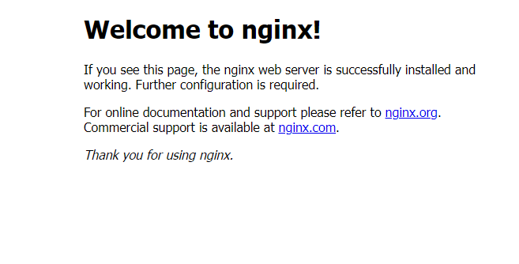
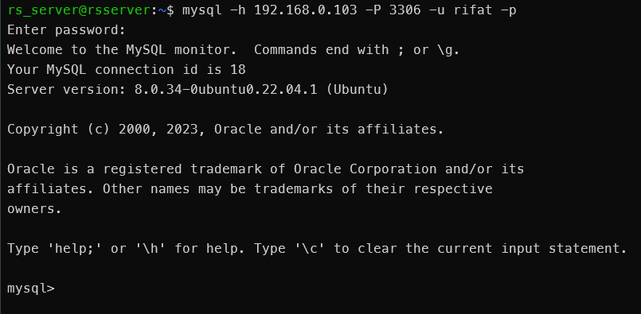
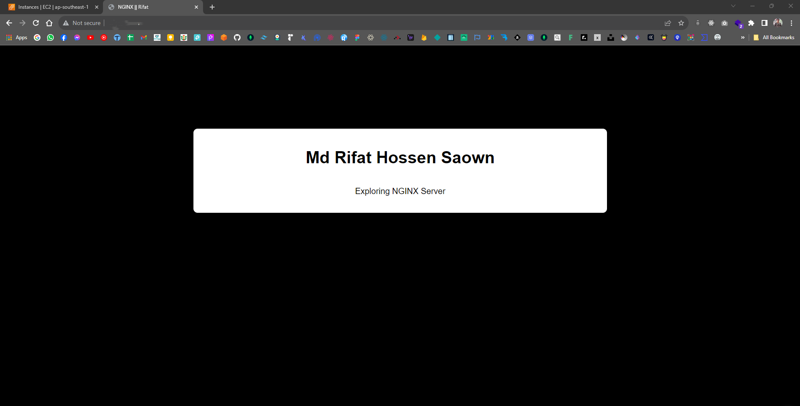

# <div align="center">Networking Basics</div>
### 1. How to find ip of a domain?
```bash
nslookup [domain name] 

#ex : 
nslookup google.com
```
or
```bash
dig [domain name]

#ex :
dig google.com
```
### 2. How to find router ip assigned by the ISP?
```bash
curl ifconfig.me
```
### 3. How to find private ip of host machine?
```bash
ip a
 ```
 or
 ``` 
 ifconfig
 ```
### 4. How to change private ip of a ubuntu machine?
```bash
# Edit yaml file inside "/etc/netplan/" and assign desire address

#ex :
sudo nano /etc/netplan/50-cloud-init.yaml
```
### 5. Check ports open in the current system?
```bash
ss -tulpn
```
### 6. Enable port 80 and 3306 in vm
```bash
sudo ufw allow 80
sudo ufw allow 3306
```
### 7. Download any file or software using terminal
```bash
wget [url]

#ex :
wget https://www.python.org/ftp/python/3.8.5/Python-3.8.5.tgz
```
### 8. Get web data response from terminal
```bash
curl [url]

#ex :
curl google.com
```
### 9. Install nginx webserver in the vm and access the welcome nginx page from web browser
```bash
sudo apt update
sudo apt install nginx
```
<!-- show img -->


### 10. Create a mysql database server in vm and access it from host machine
```bash
sudo apt update
sudo apt install mysql-server
sudo systemctl status mysql
# open mysql in terminal with root user
sudo mysql
# create user and grant permission
CREATE USER 'username'@'ip-can-access/%-for-all' IDENTIFIED BY 'password';
GRANT ALL PRIVILEGES ON *.* TO 'username'@'ip-can-access/%-for-all' WITH GRANT OPTION;
FLUSH PRIVILEGES;
# exit from mysql
exit
# open host machine terminal and access mysql
mysql -u username -h ip-address-of-vm -P 3306 -p
# enter password and access mysql
```


### 11. replace default nginx page with an index.html page containing your name and access it from web browser
```bash
# create index.html file
sudo nano /var/www/html/index.html
# add your name in index.html file
# save and exit
# remove default nginx page
sudo rm /var/www/html/index.nginx-debian.html
# restart nginx server
sudo systemctl restart nginx
# access index.html page from web browser with ip-address-of-vm 
```


### 12. Display the same index.html file in "your_name.com" by utilizing hostname of vm and host machine
```bash
# open host machine terminal and add ip-address-of-vm and your_name.com in /etc/hosts file
#ex : Linux
sudo nano /etc/hosts
#ex : Windows (run as administrator in powershell) 
notepad C:\windows\system32\drivers\etc\hosts
# add ip-address-of-vm and your_name.com in /etc/hosts file
192.168.0.103 your_name.com
# save and exit
# access your_name.com from web browser
```